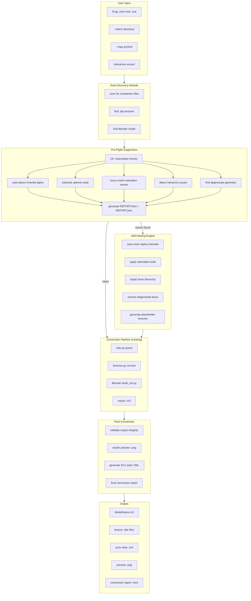

# v2.0 Architecture Diagram



## Module Map

```
wc3toSC2/
├── convert.py              # CLI orchestrator (existing, enhanced)
├── mdx.py                  # MDX v800 parser (existing)
├── blp.py                  # BLP1 decoder (existing)
├── textures.py             # DDS converter (existing)
├── build_m3.py             # Blender M3 builder (existing)

├── discovery.py            # NEW: auto-detect textures, Blender, scale
├── diagnostics.py          # NEW: 15+ pre-flight checks + report generation
├── healer.py               # NEW: auto-fix alpha, bones, geometry, textures
├── fuzzy_anims.py          # NEW: Levenshtein-based animation name matching
├── mpq_reader.py           # NEW: MPQ archive extraction
├── actor_gen.py            # NEW: SC2 actor/data XML generation

├── templates/              # NEW: material & particle presets
│   ├── materials.json
│   └── particles.json
├── presets/                # NEW: conversion profiles
│   ├── human_units.json
│   ├── undead_units.json
│   └── default.json
├── reports/                # NEW: HTML report templates
│   └── report_template.html
└── tests/
    ├── test_mdx.py
    ├── test_blp.py
    ├── test_textures.py
    ├── test_discovery.py   # NEW
    ├── test_diagnostics.py # NEW
    └── test_healer.py      # NEW
```
